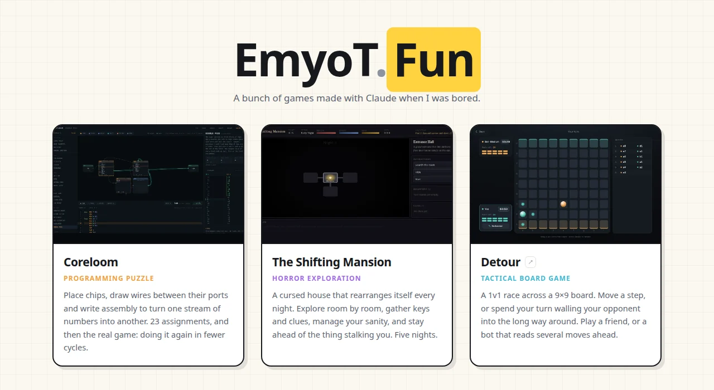

# EmyoT.Fun

A small shelf of browser games. Everything runs entirely in the browser —
nothing to install, no account, no ads, and saves never leave your machine.

### ▶ [emyotyyy.github.io/emyot.fun](https://emyotyyy.github.io/emyot.fun/)



## The games

| game | what it is | lives |
|---|---|---|
| **[Coreloom](site/coreloom/)** | A programming puzzle. Place chips, wire their ports, write assembly to turn one stream of numbers into another. 23 assignments. | in this repo |
| **[The Shifting Mansion](site/shifting-mansion/)** | Top-down horror exploration. A cursed house that rearranges itself every night, across five nights. | in this repo |
| **Detour** | A 1v1 tactical race on a 9×9 board — move, or wall your opponent into the long way around. | [its own repo](https://github.com/EmyoTyyy/detour) |

Detour is linked from the home page rather than copied in, so it stays a single
source of truth in its own repository.

## Running it locally

```
git clone https://github.com/EmyoTyyy/emyot.fun.git
cd emyot.fun
npm start          # http://localhost:7331
```

No dependencies and no build step — `npm start` serves the `site/` folder and
mirrors how GitHub Pages resolves directories, so what you see locally is what
gets published.

You do need a server rather than opening the files off the disk: Coreloom uses
ES modules, which browsers refuse to load over `file://`. (The Shifting Mansion
uses classic scripts and will open directly, if you only want that one.)

```
npm test           # Coreloom's engine tests + a solution for all 23 assignments
```

## Layout

```
server.js                local dev server, not part of the site
site/                    everything that gets published
  index.html             the home page
  css/ js/ img/          home page assets
  fonts/                 self-hosted Poppins (SIL OFL)
  coreloom/              game — see its own README
  shifting-mansion/      game — see its own README
tests/                   Coreloom's test suite
media/                   screenshots for the READMEs (not published)
```

The site makes **no third-party requests** — the typeface is served from this
repository rather than a font CDN, so loading the page does not announce a
visitor to anyone else. It follows your system light/dark preference, and the
switch in the corner overrides it and remembers the choice.

## Adding a game

Drop the game's folder into `site/`, then add one entry to the `GAMES` array in
[`site/js/home.js`](site/js/home.js) with a title, blurb, accent colour and a
screenshot in `site/img/`. Games hosted elsewhere take `external: true` and a
full URL, and the card marks them as leaving the site.

## Deploying

The workflow in [`.github/workflows/pages.yml`](.github/workflows/pages.yml)
runs the test suite and then publishes `site/`, so a broken engine never reaches
the live site. It needs **Settings → Pages → Source: GitHub Actions** once.

Every path on the site is relative, so it works both at
`emyotyyy.github.io/emyot.fun/` and at a bare domain. If you point `emyot.fun`
at it, set the custom domain under Settings → Pages; should a deploy ever drop
it, add a `site/CNAME` file containing the domain so it ships with the artifact.

## License

MIT — see [LICENSE](LICENSE). Each game keeps its own README.
