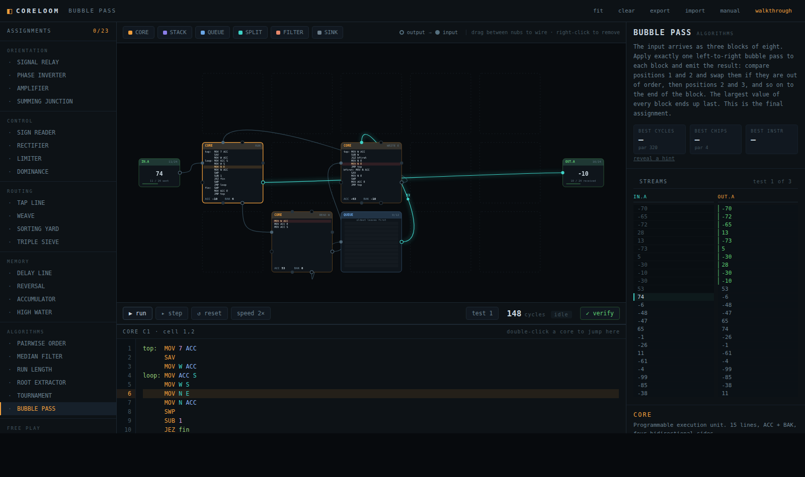
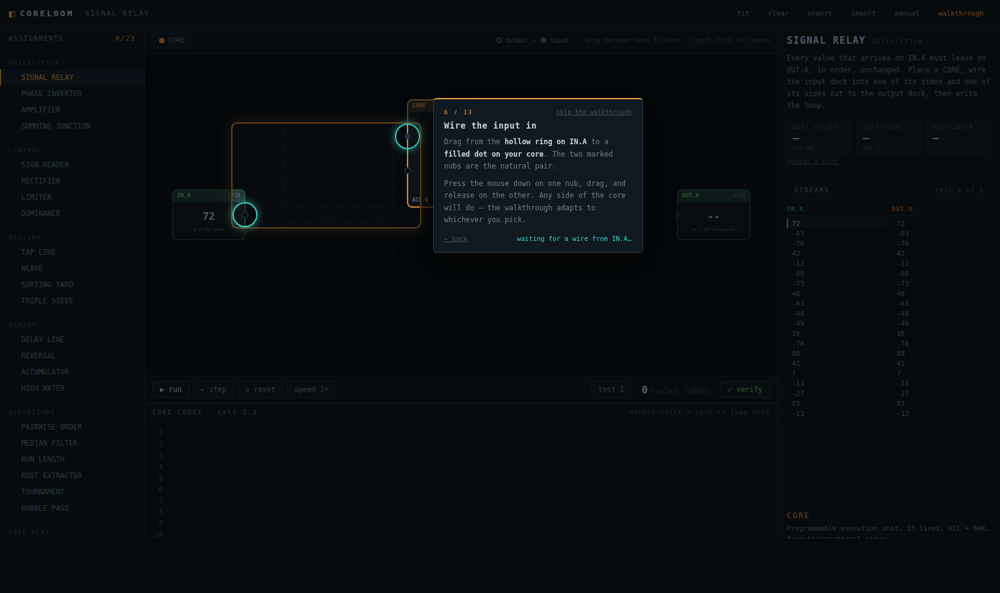

# CORELOOM

A programming puzzle game about making concurrent parts wait for each other
correctly. Numbers arrive on the left. The same numbers, transformed the way the
assignment demands, have to come out on the right. Everything in between is
yours to build.

### ▶ [Play it in your browser](https://emyotyyy.github.io/coreloom/)




Runs in any modern browser. Nothing to install, no account, no server — your
progress is saved locally in your own browser.

---

## What you actually do

Each assignment gives you an input stream, a required output stream, and an
empty board.

1. **Place chips.** Processors, stacks, queues, splitters, filters.
2. **Wire them.** Drag from an output nub to an input nub. Each port takes one
   wire, so if you need a value in two places you have to plan for it.
3. **Program the cores.** A small assembly language: 15 instructions, two
   registers, 15 lines per core.
4. **Verify.** Three test cases, two of them hidden.

Then the actual game starts, which is doing it again in fewer cycles or fewer
chips. Every assignment shows a par worth chasing.

There are **23 assignments** in five tiers — relaying a value, branching on sign,
routing streams, stacks and queues, and finally run-length encoding, integer
square roots and a sorting pass. Plus a free-play bench.

## Never played anything like this?

A **guided walkthrough starts automatically the first time you open the game**
and builds the first assignment with you. It points at real controls and waits
for you to do each step rather than clicking through slides — and it adapts, so
if you wire the input into the north side instead of the west it tells you to
write `MOV N S` instead of `MOV W E`.



You can replay it any time from **walkthrough** in the top bar, and **?** opens
the full instruction set.

## Running it locally

```
git clone https://github.com/emyotyyy/coreloom.git
cd coreloom
npm start          # http://localhost:7331
```

No dependencies and no build step — `npm start` just serves the `web/` folder.
You do need a server rather than opening `index.html` off the disk, because
browsers refuse to load ES modules over `file://`. Any static server works.

```
npm test           # engine tests + a worked solution for all 23 assignments
```

---

## How the machine works

Worth knowing, because the whole difficulty of the game comes out of it.

Simulation advances in discrete cycles, each with three strict phases:

1. **plan** — every chip declares what it wants this cycle: read a port, write a
   value to a port, or neither. Internal work (arithmetic, jumps) happens here.
2. **resolve** — for each wire, if the source offers a write *and* the
   destination requests a read in that same cycle, the value transfers. Because
   a port carries at most one wire, there is nothing to arbitrate: no priority
   rules, no ordering, no tie-breaks.
3. **commit** — every chip learns whether it got what it asked for, and updates.

Two things fall out of this:

**Transfers are a rendezvous.** Whoever arrives first waits, doing nothing, until
the other end shows up. Waiting is what costs you cycles, so most optimisation is
about making two chips want the same thing at the same moment.

**Deadlock is proven, not guessed.** If a cycle passes with no value moved and no
internal work done, the state is bit-identical to the previous cycle. The system
is deterministic, so it can never move again. The run stops there and tells you
what is starved, instead of spinning to a timeout and leaving you wondering.

### The chips

| chip | behaviour |
|---|---|
| `CORE` | Runs a program. `ACC` + `BAK`. Each side has a separate input and output port, so a side can carry traffic both ways at once. |
| `STACK` | 12 deep, last in first out. Writes push, reads pop. |
| `QUEUE` | 12 deep, first in first out. |
| `SPLIT` | Holds each value until *every wired* output has taken it. |
| `FILTER` | Compares against a constant; matches leave east, the rest leave south. |
| `SINK` | Absorbs anything. Needed more than you would think — an unread branch backs the whole line up. |

### The instruction set

```
NOP                 do nothing for a cycle
MOV  src dst        copy; a port operand blocks until the transfer happens
ADD  src            ACC = ACC + src        SUB src
MUL  src                                   DIV src   (truncates toward zero)
MOD  src            remainder, sign follows ACC
NEG                 ACC = -ACC
SAV                 BAK = ACC
SWP                 exchange ACC and BAK
JMP  label          JEZ / JNZ / JGZ / JLZ label
JRO  src            jump to (current index + src), clamped to the program
```

Operands are a literal (`-999`..`999`), `ACC`, `NIL`, or a side (`N E S W`).
Reading a side uses its input port, writing uses its output port. Arithmetic
clamps rather than wrapping. Dividing by zero faults the core.

`BAK` is deliberately not addressable — `SAV` and `SWP` are the only ways to
reach it. That single restriction is where the difficulty curve comes from:
`SUB` consumes its operand, so comparing two values costs you both, and with two
registers you cannot recover the loser. Everything hard downstream is about
duplicating a value before comparing it, parking the copies in a `QUEUE`, and
letting a second core decide which one survives.

---

## Repo layout

```
server.js                local dev server, not part of the game
web/                     the entire game — this is what gets deployed
  js/core/               isa, assembler, chips, scheduler, puzzles
  js/ui/                 board canvas, editor, panels, walkthrough
  js/data/puzzles.js     all 23 assignments
tests/
  solutions.js           a worked solution for every assignment
  run.js                 the harness
```

`npm test` runs three layers: the assembler, then machine semantics (cycle
costs, stack vs queue ordering, split fan-out, clamping, deadlock detection,
determinism, layout validation), then **every reference solution against every
hidden test case**.

That last layer is the one that matters. It is what guarantees the puzzles are
actually solvable within the chips, the board size and the line limits on offer,
rather than merely believed to be. It also measures each solution, and a final
check asserts every published par is calibrated against those real numbers.

The reference solutions are correct, not optimal. Beating them is the game.

## Forking it

The game is static and relative-pathed, so it deploys to GitHub Pages as-is.
The included workflow runs the tests and then publishes `web/`, so a broken
engine never reaches the live site. Enable it under
**Settings → Pages → Source: GitHub Actions**.

## License

MIT — see [LICENSE](LICENSE).
